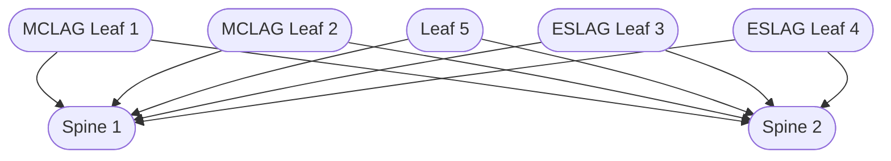
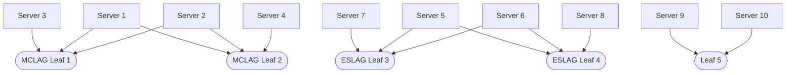

## Overview

This tutorial provides a hands-on walkthrough of the Hedgehog Demo Lab in VLAB. You will create VPCs, attach and peer them, and test connectivity between servers using the default and custom topologies.

> **Security Warning:**
> This tutorial will modify your virtual lab network state. Only run these commands in a safe, isolated lab environment.
> For more information, see [VLAB safety guidelines](../known-limitations/known-limitations.md).

> **Prerequisite:**
> This tutorial assumes you have already completed the following steps:
> - [Getting Started](getting-started.md): Access, install, and configure the CLI
> - [Running VLAB](running-vlab.md): Generate and bring up your VLAB environment (i.e., `hhfab vlab up`)
>
> **You must have a running VLAB environment before proceeding.**

---

## 1. Review the Default Topology

The default VLAB topology is Spine-Leaf with:
- 2 spines
- 2 MCLAG leaves
- 2 ESLAG leaves
- 1 non-MCLAG leaf
- 10 test servers

You can visualize the topology with the following Mermaid diagrams:

**Switches:**

**Servers:**


---

## 2. Setup VPCs Using the Utility

Hedgehog provides a utility to automate VPC creation and attachment:

```bash
hhfab vlab setup-vpcs
```
- This command sets up VPCs and VPCAttachments for all servers and configures networking.
- Run `hhfab vlab setup-vpcs --help` to see available options.

---

## 3. Create Custom VPCs and Peerings

To create custom VPCs or peerings:
1. Prepare a YAML file describing the VPC and its attachments.
2. Apply it using the CLI or `kubectl`.

**Example:**
```yaml
apiVersion: fabric.githedgehog.com/v1
kind: VPC
metadata:
  name: vpc-3
spec:
  subnet: 10.0.1.0/24
  vlan: 1001
  dhcp: true
  dhcpRange: 10.0.1.10-10.0.1.100
```
Apply with:
```bash
kubectl apply -f vpc-3.yaml
```

Attach the VPC to a server by creating a `VPCAttachment` resource.

---

## 4. Validate Connectivity

Check VPC and connection status:
```bash
kubectl get vpc
kubectl get conn | grep server
```

Log into a server VM and verify network interfaces:
```bash
kubectl exec -it server-01 -- bash
ip addr
```
Check for the expected IP addresses and VLAN interfaces.

Example output:
```console
server1$ ping server2
PING server2 (10.0.2.10) 56(84) bytes of data.
64 bytes from 10.0.2.10: icmp_seq=1 ttl=64 time=0.31 ms
64 bytes from 10.0.2.10: icmp_seq=2 ttl=64 time=0.29 ms
```

If you see packet loss or no response, see [Troubleshooting Fabric Deployments](../how-to/troubleshooting-fabric.md).

---

## 5. Experiment and Extend

- Try creating VPCs with overlapping subnets in different namespaces.
- Attach multiple servers to the same or different VPCs and test isolation.
- Use `kubectl logs` and `hhfab` utilities to debug.

---

## 6. Clean Up

To remove demo resources:
```bash
kubectl delete -f vpc-3.yaml
```
Or use the `hhfab vlab` utilities for bulk cleanup.

---

## What’s Next?
- [How to Add External Connectivity](../how-to/add-external-connectivity.md)
- [How to Upgrade Hedgehog Fabric](../how-to/upgrading-fabric.md)
- [Troubleshooting Fabric Deployments](../how-to/troubleshooting-fabric.md)
- [Architecture Overview](../explanation/architecture.md)

---

## Quality Checklist
- [ ] You have a running VLAB environment and CLI installed
- [ ] You have reviewed and understood the security warning
- [ ] You have reviewed the default topology
- [ ] You have created, attached, and peered VPCs
- [ ] You have tested connectivity between servers
- [ ] You have referenced troubleshooting guides if you encountered issues
- [ ] You have confirmed your environment matches prerequisites

---

<!--
Diátaxis: Tutorial
Version: Hedgehog v1.0.0
Last updated: 2025-04-22
-->

---
## Gaps
- [ ] Add sample output for each command
- [ ] Add troubleshooting for failed peering or connectivity
- [ ] Add advanced demo scenarios (external peering, multi-tenancy)
- [ ] Add video walkthrough
