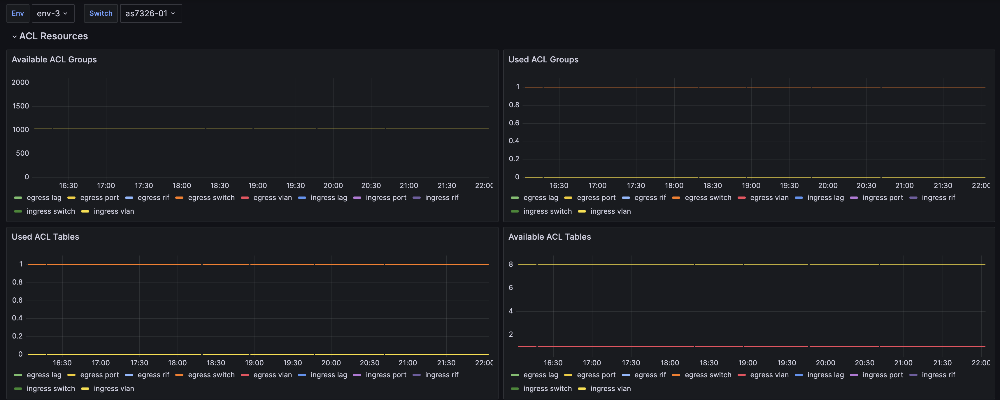
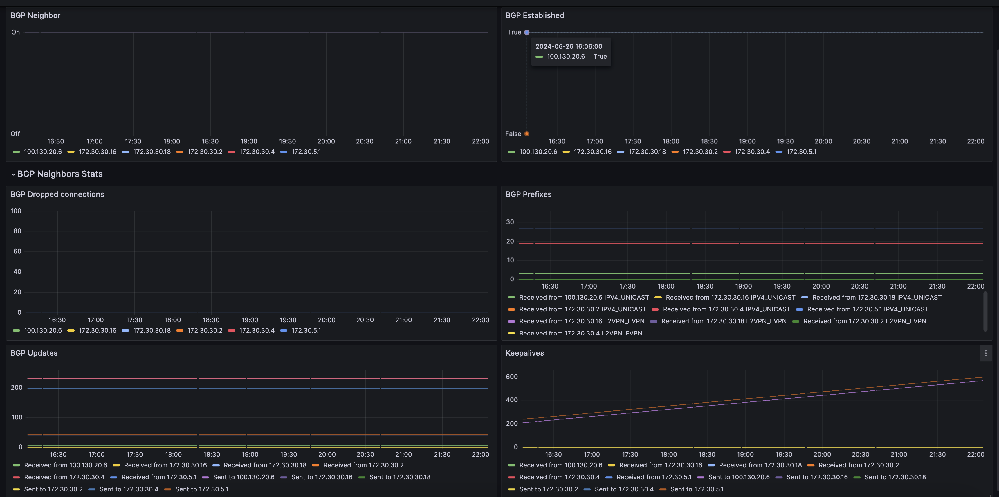
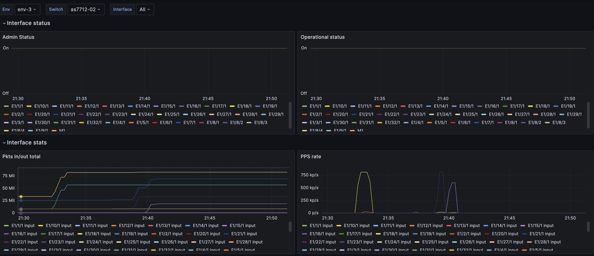
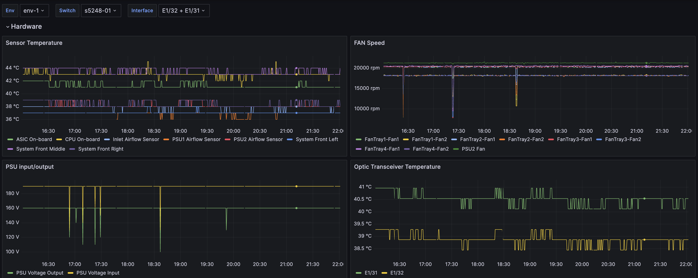
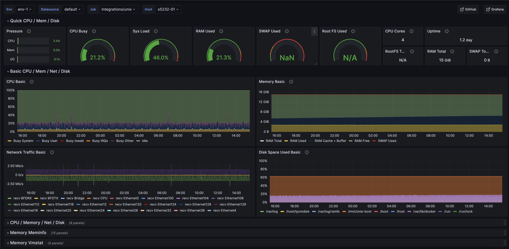

<!-- Diátaxis: How-to Guide -->

# Grafana Dashboards

> **Learning Objectives**
> By the end of this guide, you will:
> - Enable and access Hedgehog Fabric monitoring in Grafana
> - Use key dashboard variables for filtering and troubleshooting
> - Interpret critical switch, fabric, and interface metrics
> - Download and import Hedgehog dashboard JSONs

To monitor critical metrics from switches managed by Hedgehog Fabric, several dashboards are available for Grafana deployments. Ensure you have enabled metrics and log collection as described in the [Fabric Config: Telemetry](../install-upgrade/config.md#telemetry) section.

## 1. Enable Telemetry

Follow the [Fabric Config: Telemetry](../install-upgrade/config.md#telemetry) instructions to:
- Enable metrics and log collection on all switches
- Confirm Prometheus and Loki endpoints are reachable from Grafana

## 2. Import Hedgehog Dashboards

Download Hedgehog dashboard JSON files and import them into Grafana:
- [ASIC Critical Resources](./boards/grafana_crm.json)
- [Fabric BGP Stats](./boards/grafana_fabric.json)
- [Interfaces](./boards/grafana_interfaces.json)
- [Logs](./boards/grafana_logs.json)
- [Platform](./boards/grafana_platform.json)
- [Node Exporter](./boards/grafana_node_exporter.json)

> **Tip:** In Grafana, go to **Dashboards → Import**, then upload the JSON file or paste its contents.

## 3. Dashboard Variables

Use these common variables to filter and explore Hedgehog dashboards:

- **env** (Label: Env): `label_values(env)` — Environment to monitor
- **node** (Label: Switch): `label_values(hostname)` — Switch name
- **vrf** (Label: VRF): `label_values(vrf)` — VRF name (multi-value)
- **neighbor** (Label: Neighbor): `label_values(neighbor)` — BGP neighbor IP (multi-value)
- **interface** (Label: Interface): `label_values(interface)` — Switch interface name (multi-value)
- **file** (Label: File): `label_values(filename)` — Log file name (Loki)

## 4. Switch Critical Resources

This dashboard reports usage and capacity of ASIC programmable resources:
- ACLs
- IPv4 Routes
- IPv4 Nexthops
- IPv4 Neighbors
- IPMC Table
- FDB

## 5. Fabric and BGP Monitoring

Monitor underlay and external peering, including:
- BGP neighbors and session states
- Number of BGP updates and prefixes sent/received
- Keepalive counters

## 6. Interface Metrics

Track interface state, errors, and traffic statistics.

## 7. System and Logs

- **System:** Monitor CPU, memory, and disk usage on switches
- **Logs:** Use the Logs dashboard to search and filter logs via Loki

## 8. Platform

Monitor platform metrics, including:
- PSU voltage
- Fan speed
- Temperature sensors
- Optic sensor temperature for transceivers with DOM

## 9. Node Exporter

Use the Node Exporter dashboard to monitor Linux node metrics, including:
- Memory and disk usage
- CPU and system utilization
- Networking statistics

> 

> 
Troubleshooting & Advanced Tips

> - Ensure Prometheus and Loki are scraping switch metrics and logs
> - Use dashboard variables to isolate issues by environment, node, or interface
> - Refer to [Fabric Config: Telemetry](../install-upgrade/config.md#telemetry) for advanced telemetry options
> 

---

> **Next:** [Shrink/Expand the Fabric](./shrink-expand.md)
